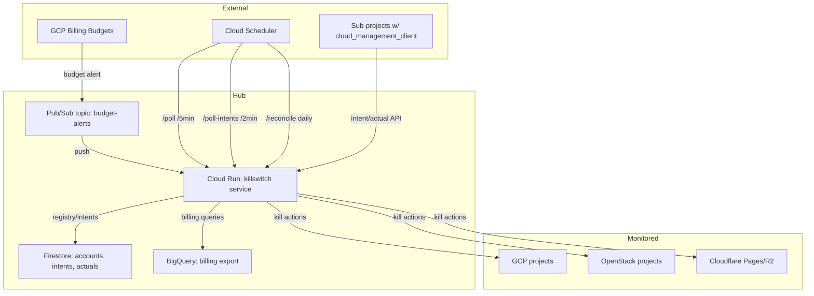

# System Overview

## System context

## Users and external systems

| Actor | Interaction | Trust boundary |
|-------|-------------|----------------|
| Cloud Billing budgets | Pub/Sub push to `POST /` | External → hub (OIDC-authenticated push) |
| Cloud Scheduler | OIDC-authenticated HTTP to `/poll`, `/poll-intents`, `/reconcile` | External → hub (IAM-restricted) |
| Sub-project client (`cloud_management_client`) | `POST /api/v1/intent`, `/api/v1/actual`, `GET /api/v1/budget/*`, `GET /api/v1/kill-orders` | External → hub (per-project bearer token) |
| Dashboard user (human) | `GET /dashboard` | Browser → hub (Cloud Run IAM in prod; unauth in dev) |
| Monitored GCP projects | Kill actions via `google-cloud-*` APIs | Hub → external (service account IAM at org/folder level) |
| OpenStack projects | Kill via `openstack` CLI subprocess | Hub → external (credentials via env) |
| Cloudflare | Kill via API | Hub → external (API token via env) |

## Deployable units

| Unit | Type | Entry | Deploy |
|------|------|-------|--------|
| Kill switch service | Flask app on Cloud Run | `main.py` | Terraform `terraform/cloud_run.tf` or `scripts/deploy.sh` |
| `cloud_management_client` | pip package (v0.12.0) | `cloud_management_client/__init__.py` | `pip install cloud-management-client` (vendored by sub-projects) |

## Data flows

1. **Budget alert path:** Cloud Billing → Pub/Sub → Cloud Run `POST /` →
   parse alert → evaluate threshold → `execute_killswitch()` per target project.
2. **Quota poll path:** Cloud Scheduler → `POST /poll` → `poll_all_accounts()` →
   Monitoring API metrics → `execute_killswitch()` on trip.
3. **Intent/actual path:** Sub-project client → `POST /api/v1/intent` (declare)
   → `POST /api/v1/actual` (report) → overrun detection → `kill_intent()`.
4. **Intent poll path:** Cloud Scheduler → `POST /poll-intents` → check all
   running intents for overrun/budget → kill if exceeded.
5. **Reconciliation path:** Cloud Scheduler daily → `POST /reconcile` →
   `providers.fetch_billed_costs()` → compare vs self-reports → recalibrate.
6. **Dashboard path:** Browser → `GET /dashboard` → BigQuery billing queries
   (5-min cached) → render HTML template.

## Trust boundaries

- **Cloud Run IAM** restricts `/poll`, `/poll-intents`, `/reconcile` to the
  `killswitch-rt` service account (OIDC from Cloud Scheduler/Pub/Sub).
  OBSERVED in `terraform/iam.tf` + `admin_routes.py` docstring.
- **Per-project bearer tokens** protect intent/actual endpoints
  (`intent_auth.py:_validate_token`). OBSERVED.
- **Dashboard** has no app-level auth — relies on Cloud Run IAM in prod.
  OBSERVED in `dashboard.py` (no auth checks).
- **Self-protection invariant:** `SELF_PROJECT_ID` hard-block in
  `execute_killswitch()`, `poll_all_accounts()`, `handle_poll_intents()`.
  OBSERVED in `main.py`, `poller.py`, `admin_routes.py`.
